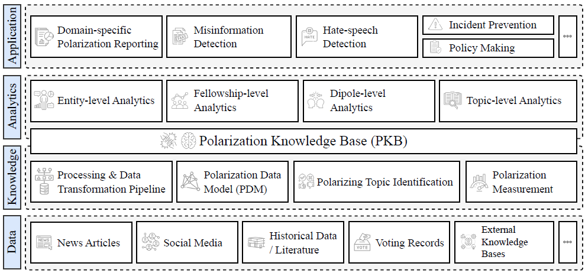
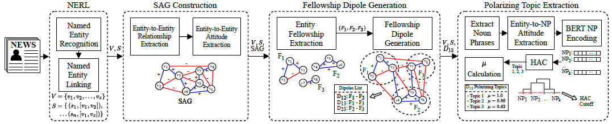
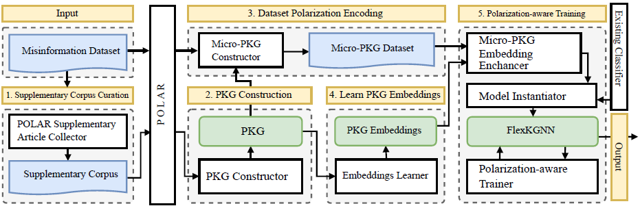

# Polarlib Package

The `polarlib` is a Python library designed for modeling, extracting, analyzing, and integrating polarization knowledge into machine learning tasks. It consists of three main components:

1. **POLAR:** An end-to-end pipeline for unsupervised extraction and modeling of domain-specific Polarization Knowledge Graphs (PKGs) from news articles.
2. **PRISM:** A suite of multi-level polarization analysis and quantification tools, providing insights into polarization dynamics across entities, groups, and topics.
3. **PARALLAX:** A framework that integrates polarization knowledge into machine learning tasks, enhancing classification accuracy in applications like misinformation detection and hate-speech identification.

**Use Cases:**  
The `polarlib` library is ideal for applications in political discourse studies, misinformation detection, social media analysis, enabling robust, context-aware models in polarized information environments.



*Figure 1: Abstract hierarchical representation of the proposed framework, illustrating the data, knowledge, analytics, and application layers.*

## Table of Contents

- [Introduction](#introduction)
- [Dependencies](#dependencies)
- [Usage](#usage)
- [Citations](#citations)
  
## Introduction

The `polarlib` library facilitates the modeling, analysis, and visualization of multi-level polarization and sentiment data. It provides a collection of modules and classes for the entire polarization analysis pipeline, including data collection, entity extraction, topic identification, sentiment attitude classification, graph generation, and more.

## Dependencies

### 1. **spaCy** for NLP Tasks

```bash
pip install spacy

python -m spacy download en_core_web_sm
```
### 2. **DBPedia Spotlight** for Entity Linking

`DBPedia Spotlight` is used in `polarlib` for Named Entity Linking (NEL). It links named entities from the text to their corresponding entries in DBpedia, providing a more structured representation of the entities. The entity/actor extractor component depends on the DBPedia Spotlight service, which requires around 4GB of RAM and 2GB of storage.

```bash
# Run DBPedia Spotlight as a Docker container
docker run -tid --restart unless-stopped --name dbpedia-spotlight.en \
  --mount source=spotlight-model,target=/opt/spotlight \
  -p 2222:80 dbpedia/dbpedia-spotlight spotlight.sh en
```

### 3. **Gurobi Optimizer** - Structural Polarization Calculation

`Gurobi Optimizer` is a powerful optimization tool required by `polarlib` to compute the frustration index, which is an essential component of structural balance analysis in the Polarization Knowledge Graph (PKG). Gurobi offers a free academic license for educational use.

#### Setting Up Gurobi

1. **Download Gurobi Optimizer:**
   - Visit [Gurobi Downloads](https://www.gurobi.com/downloads/gurobi-software/) and download the appropriate installer for your operating system.

2. **Install Gurobi:**
   - For Windows, run the following command:
     ```bash
     msiexec /i Gurobi-11.0.2-win64.msi /norestart
     ```
   - For Linux/Mac:
     ```bash
     tar xvfz gurobi11.0.2_linux64.tar.gz
     cd gurobi1110/linux64/
     sudo python3 setup.py install
     ```

3. **Set up an Academic License:**
   - Gurobi offers a free academic license. Sign up at [Gurobi Academic License](https://www.gurobi.com/academia/academic-program-and-licenses/) and follow the instructions to activate your license.

## Usage

### POLAR Quickstart



*Figure 2: POLAR architecture for the unsupervised and domain-agnostic extraction of polarization knowledge from news articles.*

The main components of POLAR include:

- News Corpus Collector: Collects news articles related to specific keywords and time frames.
- Entity and Noun Phrase Extraction: Extracts entities and noun phrases from collected articles.
- Discussion Topic Identification: Identifies discussion topics based on extracted noun phrases.
- Sentiment Attitude Classification: Classifies sentiment attitudes using syntactical methods.
- Sentiment Attitude Graph Generation: Generates sentiment attitude graphs for analysis.
- Entity Fellowship Extraction: Extracts entity fellowships from generated graphs.
- Fellowship Dipole Generation: Generates fellowship dipoles based on extracted fellowships.
- Dipole Topic Polarization: Calculates topic polarization based on generated dipoles.

To use the `polarlib` library, follow these steps:

1. Clone the repository: `git clone https://github.com/dpasch01/polarlib.git`
2. Install the dependencies: `pip install -t requirements.txt`
3. Use the code snippets below:

```python
from polarlib.polar.attitude.syntactical_sentiment_attitude import SyntacticalSentimentAttitudePipeline
from polarlib.polar.news_corpus_collector import *
from polarlib.polar.actor_extractor import *
from polarlib.polar.topic_identifier import *
from polarlib.polar.coalitions_and_conflicts import *
from polarlib.polar.sag_generator import *

# Example Workflow
OUTPUT_DIR = "/tmp/example"
keywords = ["openai", "altman", 'chatgpt', 'gpt']

# Collect news corpus
corpus_collector = NewsCorpusCollector(
    output_dir = OUTPUT_DIR,
    from_date = date(year=2023, month=11, day=16),
    to_date = date(year=2023, month=11, day=23),
    keywords = keywords
)

corpus_collector.collect_archives()
corpus_collector.collect_articles(n_articles = 250)
corpus_collector.pre_process_articles()

# Extract entities and noun phrases
entity_extractor = EntityExtractor(output_dir=OUTPUT_DIR, coref=False)
entity_extractor.extract_entities()

noun_phrase_extractor = NounPhraseExtractor(output_dir=OUTPUT_DIR)
noun_phrase_extractor.extract_noun_phrases()

# Extract the discussion topics
topic_identifier = TopicIdentifier(output_dir=OUTPUT_DIR, llama_wv=False)
topic_identifier.encode_noun_phrases()
topic_identifier.noun_phrase_clustering(threshold=0.8)

# Calculate the attitudes between entities and topics
sentiment_attitude_pipeline = SyntacticalSentimentAttitudePipeline(
	output_dir  = OUTPUT_DIR,
        nlp = spacy.load("en_core_web_sm"),
	dictionary_path = "mpqa.csv"
)

sentiment_attitude_pipeline.calculate_sentiment_attitudes()

# Construct the Sentiment Attitude Graph (SAG)
sag_generator = SAGGenerator(OUTPUT_DIR)

sag_generator.load_sentiment_attitudes()

bins = sag_generator.calculate_attitude_buckets(verbose=True, figsize=(16, 4))

sag_generator.convert_attitude_signs(
    bin_category_mapping = {
        "NEGATIVE": [(-1.00, -0.02)],
        "NEUTRAL": [(-0.02, 0.02)],
        "POSITIVE": [(0.02, 1.00)]
    },
    minimum_frequency = 5,
    verbose = True
)

G, node_to_int, int_to_node = sag_generator.construct_sag()

# Extract the fellowships and dipoles
fellowship_extractor = FellowshipExtractor(OUTPUT_DIR)

fellowships = fellowship_extractor.extract_fellowships(
    n_iter = 10,
    resolution = 0.075,
    merge_iter = 10,
    jar_path ='./polarlib',
    verbose = True,
    output_flag = True
)

dipole_generator = DipoleGenerator(OUTPUT_DIR)
dipoles = dipole_generator.generate_dipoles(f_g_thr=0.7, n_r_thr=0.5)

# Calculate topic polarization
topic_attitude_calculator = TopicAttitudeCalculator(OUTPUT_DIR)

topic_attitude_calculator.load_sentiment_attitudes()

dipole_topics_dict = topic_attitude_calculator.get_polarization_topics()

topic_attitudes = topic_attitude_calculator.get_topic_attitudes()

```

### PRISM Quickstart


*Figure 3: PRISM framework architecture for multi-level polarization analysis.*

PRISM provides tools to analyze polarization across entity, group, and topic levels using various metrics. Key functions include:

1. **Entity-Level Analysis:** Determines "protagonists" (entities that mitigate polarization) and "antagonists" (entities that exacerbate it). Utilizes Signed Semantic Association (SSA) metrics.
2. **Group-Level Analysis:** Assesses ideological and attitudinal cohesiveness within fellowships. Uses spectrum values (e.g., Left-Right) to evaluate group alignment.
3. **Topic-Level Analysis:** Ranks topics by their polarization scores, assessing how different entities’ attitudes contribute to topic divisiveness.

**UPDATE:** `EntityLevelPolarizationAnalyzer` requires also `POLE` to construct node-level polarization scores. Before proceeding, execute the following: `git clone https://github.com/zexihuang/POLE`.

```python
from polarlib.prism.polarization_knowledge_graph import PolarizationKnowledgeGraph

pkg = PolarizationKnowledgeGraph(output_dir = OUTPUT_DIR)
pkg.construct()

# Entity-Level Analysis
from polarlib.prism.multi_level_polarization import EntityLevelPolarizationAnalyzer

entity_level_analyzer = EntityLevelPolarizationAnalyzer()
entity_df = entity_level_analyzer.analyze(pkg, pole_path='./', output_dir=OUTPUT_DIR)
print(entity_df.head(5))

# Group-Level Analysis
from polarlib.prism.multi_level_polarization import GroupLevelPolarizationAnalyzer

group_analyzer = GroupLevelPolarizationAnalyzer()
coh_df, att_df = group_analyzer.analyze(pkg, output_dir=OUTPUT_DIR, download_flag=False, wlpa_flag=True)

print(coh_df.head(10))
print(att_df.head(10))

# Topic-Level Analysis
from polarlib.prism.multi_level_polarization import TopicLevelPolarizationAnalyzer

topic_analyzer = TopicLevelPolarizationAnalyzer()
local_df, global_df = topic_analyzer.analyze(pkg)

print(local_df.head(10))
print(global_df.head(10))
```

### PARALLAX Quickstart

PARALLAX enables the use of polarization knowledge in supervised machine learning tasks, enhancing classifiers for misinformation detection. It builds on the PKG to represent article-level polarization knowledge through micro-PKGs and applies a GNN (Graph Neural Network) to incorporate polarization as a feature for existing classifiers.



*Figure 4: PARALLAX framework architecture for integrating polarization knowledge into misinformation detection.*

1. **Supplementary Corpus Curation:** Gathers a Supplementary Corpus of domain-relevant articles that provide contextual polarization knowledge.
2. **PKG Construction:** Constructs a Polarization Knowledge Graph for each domain, representing entity interactions and affiliations.
3. **Micro-PKG Construction:** Builds micro-PKGs for individual articles in the dataset, with sentiment-driven entity relations.
4. **Embedding Generation:** Learns polarization embeddings for micro-PKGs.
5. **Polarization-Aware Training:** Incorporates FlexKGNN, a GNN model designed to combine micro-PKG features with traditional classifier features, achieving enhanced classification performance.

[](https://opensource.org/licenses/MIT)

## Citations

```bibtex
@article{
  10.1145/3703594,
  author = {Paschalides, Demetris and Pallis, George and Dikaiakos, Marios},
  title = {A Framework for the Unsupervised Modeling and Extraction of Polarization Knowledge from News Media},
  year = {2024},
  publisher = {Association for Computing Machinery},
  address = {New York, NY, USA},
  url = {https://doi.org/10.1145/3703594},
  doi = {10.1145/3703594},
  journal = {Trans. Soc. Comput.},
  month = dec
}
```

```bibtex 
@inproceedings{
  paschalides2024parallax,
  author = {Paschalides, Demetris and Pallis, George and Dikaiakos, Marios D.},
  title = {PARALLAX: Leveraging Polarization Knowledge for Misinformation Detection},
  year = {2024},
  booktitle = {Proceedings of the 2024 IEEE/ACM International Conference on Advances in Social Networks Analysis and Mining},
  series = {ASONAM '24}
}
```

```bibtex 
@inproceedings{
  paschalides2021polar,
  author = {Paschalides, Demetris and Pallis, George and Dikaiakos, Marios D.},
  title = {POLAR: A Holistic Framework for the Modelling of Polarization and Identification of Polarizing Topics in News Media},
  booktitle = {Proceedings of the 2021 IEEE/ACM International Conference on Advances in Social Networks Analysis and Mining},
  series = {ASONAM '21}
}
```


