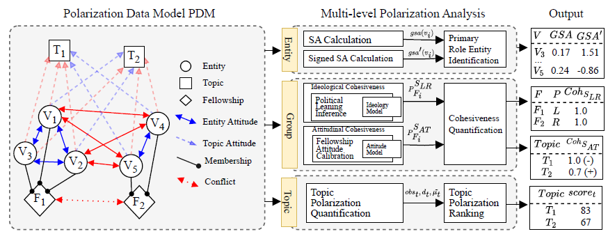

# Polarlib / PRISM

A suite of multi-level polarization analysis and quantification tools, providing insights into polarization dynamics across entities, groups, and topics.

### PRISM Quickstart



*Figure 3: PRISM framework architecture for multi-level polarization analysis.*

PRISM provides tools to analyze polarization across entity, group, and topic levels using various metrics. Key functions include:

1. **Entity-Level Analysis:** Determines "protagonists" (entities that mitigate polarization) and "antagonists" (entities that exacerbate it). Utilizes Signed Semantic Association (SSA) metrics.
2. **Group-Level Analysis:** Assesses ideological and attitudinal cohesiveness within fellowships. Uses spectrum values (e.g., Left-Right) to evaluate group alignment.
3. **Topic-Level Analysis:** Ranks topics by their polarization scores, assessing how different entities’ attitudes contribute to topic divisiveness.

**UPDATE:** `EntityLevelPolarizationAnalyzer` requires also `POLE` to construct node-level polarization scores. Before proceeding, execute the following: `git clone https://github.com/zexihuang/POLE`.

```python
from polarlib.prism.polarization_knowledge_graph import PolarizationKnowledgeGraph

pkg = PolarizationKnowledgeGraph(output_dir = OUTPUT_DIR)
pkg.construct()

# Entity-Level Analysis
from polarlib.prism.multi_level_polarization import EntityLevelPolarizationAnalyzer

entity_level_analyzer = EntityLevelPolarizationAnalyzer()
entity_df = entity_level_analyzer.analyze(pkg, pole_path='./', output_dir=OUTPUT_DIR)
print(entity_df.head(5))

# Group-Level Analysis
from polarlib.prism.multi_level_polarization import GroupLevelPolarizationAnalyzer

group_analyzer = GroupLevelPolarizationAnalyzer()
coh_df, att_df = group_analyzer.analyze(pkg, output_dir=OUTPUT_DIR, download_flag=False, wlpa_flag=True)

print(coh_df.head(10))
print(att_df.head(10))

# Topic-Level Analysis
from polarlib.prism.multi_level_polarization import TopicLevelPolarizationAnalyzer

topic_analyzer = TopicLevelPolarizationAnalyzer()
local_df, global_df = topic_analyzer.analyze(pkg)

print(local_df.head(10))
print(global_df.head(10))
```
